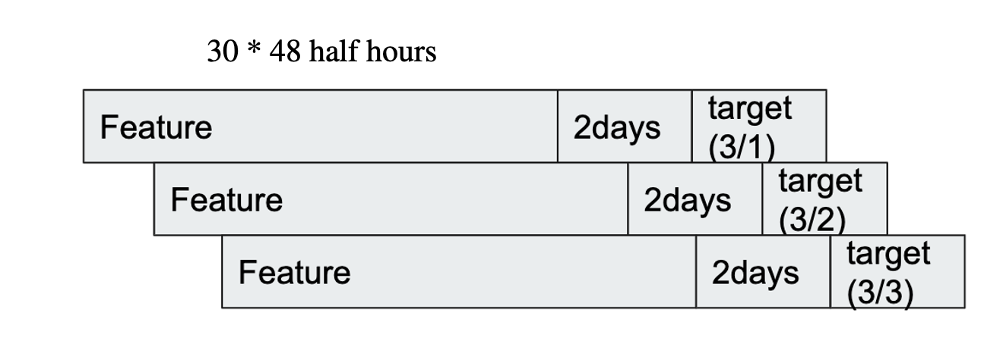
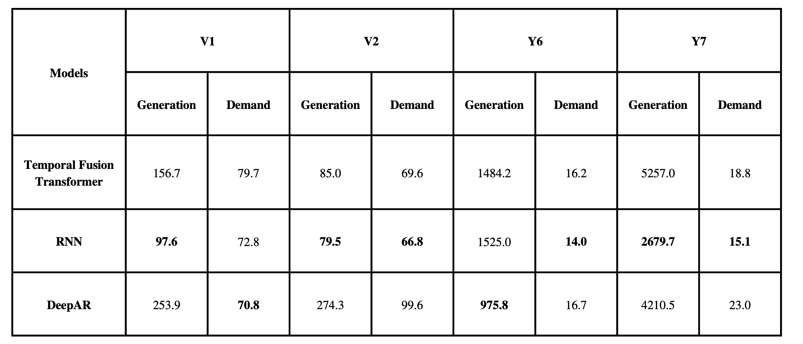

# DevDay2023 - Optimizer Power Use
## Problem statement
- Unlike other renewable energy like coal, oil and gas, electric energy is hard to store at large scale and expensive at small scale. Thus, it must be consumed in real-time as it is generated. The commercial energy company will struggle to provide to end-users with safe and stable energy. Therefore, it is important to avoid significantly exceeding the required amount of electricity.
- Igrid Solution - a Japanese company provide services for energy consumers that want to handle that problem. So forecasting power generation and power demand at grid is great choice.
## Data Description
- Dataset (Data granularity: Half Hour):
    - Target features: Power Generation, Power demand
    - Time varying known features: Time, date
    - Time varying unknown features: weather, solar and cloud intensity

- Metric to evaluate: (The judges called it Residual Mean Ratio Metric) \
    $
        RMR = \sum_{i = 0}^{N}\frac{pred - actual}{actual}
    $

- <strong>The dataset is confidential so i can't public it.</strong>

## Preprocessing
- Add Features:
    - Date -> Year/Month/Day and day of the week
    - Half hours from start
- Normalization:
    - Numerical: Group Normalizer
    - Categorical: NaNLabelEncoder
- Outlier:
    - Exponential Smoothing
    - Kalman Smoothing
- Imputation Techniques:
    - KNN
    - Chained Equation (MICE)

## Prepare Dataset
- Train set: From 25/03/2022 to 31/01/2023
- Validation set: From 01/02/2023 to 28/02/2023
- Test set: From 01/03/2023 to 31/03/2023
- Max Encoder Days: 30 days * 48 half hours in each day before the target day

## Models
- RNN, DeepAR, Temporal Fusion Transformer. They are implemented in [Pytorch-forecasting](https://pytorch-forecasting.readthedocs.io/en/stable/).
## Bechmark

- <strong>Get high values at some cases when predicted values are higher than double of actual values. Because there is a day in validation set that grid doesn't generate the energy because of reasons like bad weather, eletric cut, etc...</strong>

## References
- [Pytorch-forecasting](https://pytorch-forecasting.readthedocs.io/en/stable/)
- [tsmoothie](https://github.com/cerlymarco/tsmoothie)